<div align="center">
  

  # LAN Screen Share 🚀

  **High-performance, zero-config local network screen sharing.**
  <br />
  *Watch your PC screen on your mobile device instantly, securely, and without the public internet.*

  <br />

  
  
  
  
  
  
  
  <br />
  
  [](https://github.com/badhonvitality/lanshare?tab=MIT-1-ov-file)
  [](https://opensource.org/)
  [](https://github.com/badhonvitality/lanshare/actions)
</div>

<hr />

## ✨ Features

- ⚡ **Ultra Low Latency**: Direct Peer-to-Peer WebRTC connection inside your LAN.
- 📱 **Mobile First Viewer**: Beautiful, gesture-friendly mobile UI with horizontal orientation lock.
- 🔒 **Secure by Default**: Streams never touch the cloud. Self-signed SSL included.
- 📷 **Built-in QR Scanner**: Scan to connect instantly without typing IP addresses.
- 🌐 **Zero-config mDNS**: Connect via `https://lanshare.local` automatically.
- 🎨 **Premium UI**: Smooth animations powered by Lenis and Framer-like aesthetics.

---

## 🛠️ Tech Stack
- **Framework**: [Next.js 15 (App Router)](https://nextjs.org/)
- **Language**: [TypeScript](https://www.typescriptlang.org/)
- **Styling**: [Tailwind CSS](https://tailwindcss.com/)
- **Real-time Signaling**: [Socket.io](https://socket.io/)
- **Streaming**: [WebRTC (RTCPeerConnection)](https://webrtc.org/)
- **State Management**: [Zustand](https://github.com/pmndrs/zustand)
- **Package Manager**: [Bun](https://bun.sh/)

---

## 🏗️ Architecture

```mermaid
sequenceDiagram
    participant H as Host (PC)
    participant S as Signaling Server (Node.js)
    participant V as Viewer (Mobile)
    
    Note over H,S: Connect via wss://lanshare.local
    H->>S: Create Room & Join
    Note over V,S: Connect via QR Code URL
    V->>S: Join Room
    
    rect rgb(30, 30, 30)
    Note over H,V: WebRTC Peer-to-Peer Handshake
    H->>V: SDP Offer (via Server)
    V->>H: SDP Answer (via Server)
    H-->>V: ICE Candidates
    V-->>H: ICE Candidates
    end
    
    Note over H,V: 🚀 Direct Local LAN Stream Established!
    H->>V: Video Stream (No Cloud/Internet Routing)
```



---

## 🚀 Quick Start

1. **Install dependencies**:
   ```bash
   bun install
   ```

2. **Start the server**:
   ```bash
   bun run server.ts
   # OR just double-click start.bat on Windows
   ```

3. **Host a stream**:
   Open `https://localhost` on your PC, click **Start Sharing**, and choose the screen or window.

4. **Connect from Mobile**:
   Open `https://lanshare.local` on your phone (ensure you're on the same Wi-Fi), click **Scan to Connect**, and scan the QR code displayed on your PC.

*(Note: Because this app generates its own self-signed SSL certificate for local HTTPS, you may need to click "Advanced -> Proceed" in your browser warning the first time you connect).*

---

## 💖 Credits & Acknowledgment

This project is proudly brought to you by:
- **Badhon Vitality**
- **Webda Studio** — [https://webda.in](https://webda.in)

We believe in open source and empowering developers with secure, privacy-first local tools.

---

## 💬 Support & Contributing

If you need help setting this up or just want to chat:
- **Discord**: `@badhonvitality`

### 🐛 Reporting Bugs & Requesting Features
- **[Report a Bug](https://github.com/badhonvitality/lanshare/issues/new?assignees=&labels=bug&projects=&template=bug_report.md&title=%5BBUG%5D+)**: Found something broken? Let us know!
- **[Request a Feature](https://github.com/badhonvitality/lanshare/issues/new?assignees=&labels=enhancement&projects=&template=feature_request.md&title=%5BFEATURE%5D+)**: Have a great idea for the app?

Feel free to submit a pull request! Please make sure to read our [Code of Conduct](https://github.com/badhonvitality/lanshare?tab=coc-ov-file), [Contributing Guidelines](https://github.com/badhonvitality/lanshare?tab=contributing-ov-file), and [Security Policy](https://github.com/badhonvitality/lanshare?tab=security-ov-file).

---
<div align="center">
  <i>Built with ❤️ for the Open Source Community.</i>
</div>
